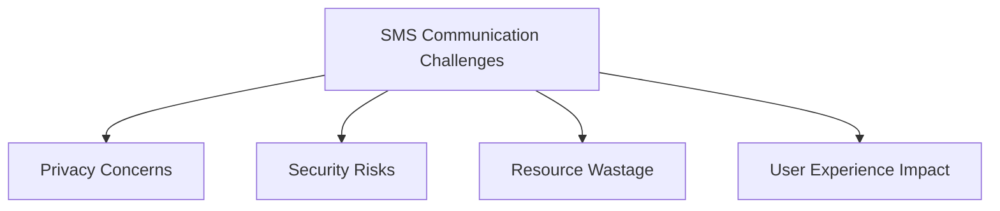
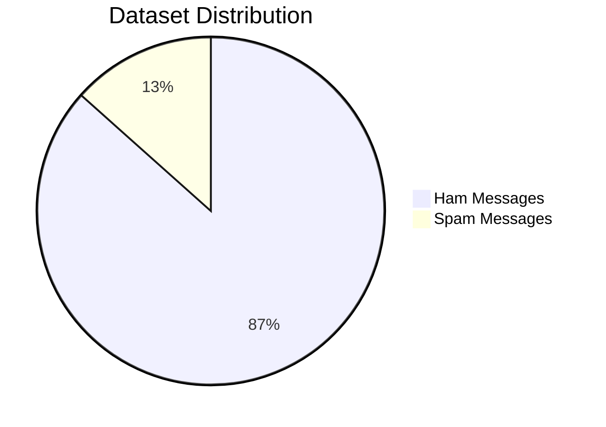
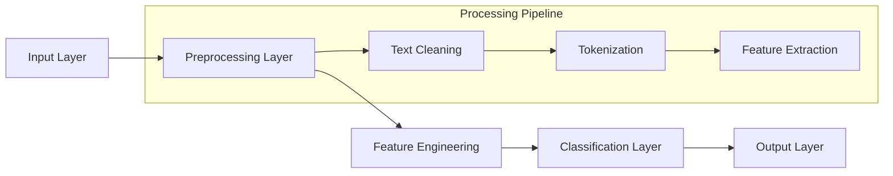
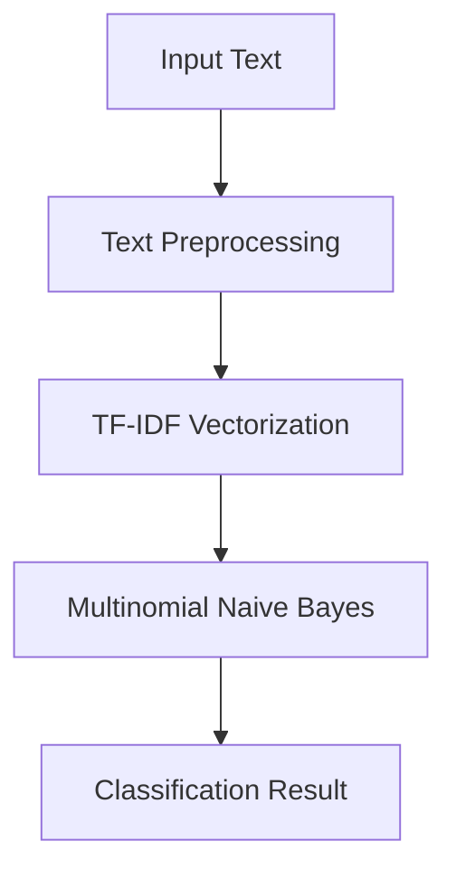
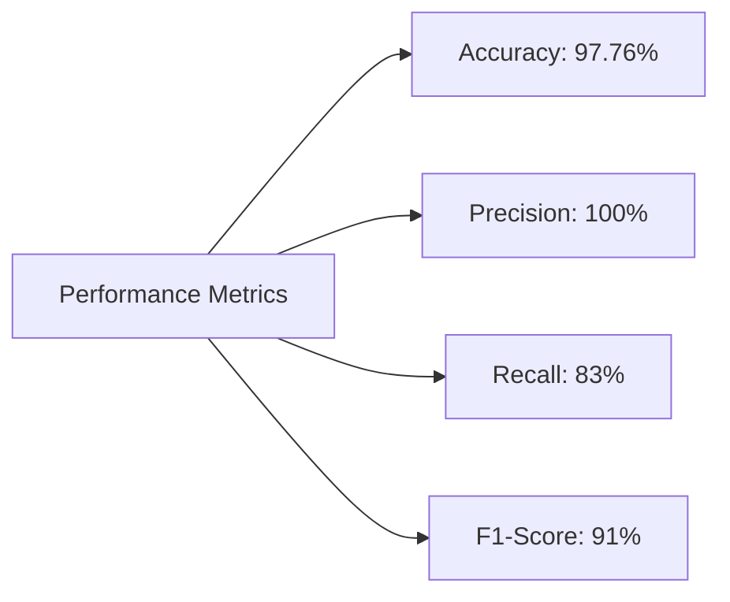
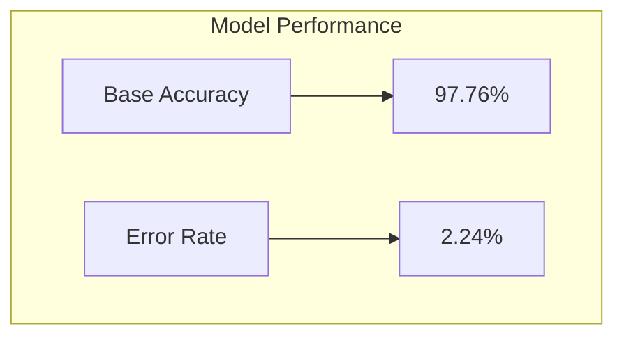

# SMS Spam Detection System
## Technical Documentation and Analysis Report

-----------------------------------------------------------
**Document Control Information**

| Document Details | |
|-----------------|--------------------------|
| Title | SMS Spam Detection System |
| Author | Shubhrajyoti Bagchi |
| Date | November 18, 2024 |
| Version | 1.0 |
| Status | Final |


-----------------------------------------------------------

## Table of Contents

1. [Executive Summary](#1-executive-summary)
2. [Introduction](#2-introduction)
3. [System Architecture](#3-system-architecture)
4. [Implementation Details](#4-implementation-details)
5. [Performance Analysis](#5-performance-analysis)
6. [Deployment Guide](#6-deployment-guide)
7. [Future Recommendations](#7-future-recommendations)
8. [Appendices](#8-appendices)

-----------------------------------------------------------

## 1. Executive Summary

This document presents a comprehensive analysis of our SMS Spam Detection System, which achieves 97.76% accuracy in classifying messages. The system employs Natural Language Processing (NLP) techniques and Machine Learning algorithms to automatically identify and filter spam messages.

### Key Achievements:
- 97.76% Classification Accuracy
- 100% Precision Rate
- 83% Recall Rate
- Production-Ready Implementation
- Real-Time Classification Capabilities

-----------------------------------------------------------

## 2. Introduction

### 2.1 Project Overview

The SMS Spam Detection System is designed to automatically classify incoming SMS messages as either legitimate (ham) or spam. This system addresses the growing concern of unwanted messages in mobile communications.

### 2.2 Problem Statement



### 2.3 Dataset Characteristics

**Source Dataset Analysis:**
- Total Messages: 5,572
- Distribution:
  - Ham Messages: 4,825 (86.6%)
  - Spam Messages: 747 (13.4%)



-----------------------------------------------------------

## 3. System Architecture

### 3.1 High-Level Architecture



### 3.2 Component Details

#### 3.2.1 Text Preprocessing Pipeline
```python
def preprocess_text(text):
    # Convert to lowercase
    text = text.lower()
    
    # Tokenization
    tokens = nltk.word_tokenize(text)
    
    # Remove special characters
    tokens = [t for t in tokens if t.isalnum()]
    
    # Remove stopwords
    tokens = [t for t in tokens if t not in stop_words]
    
    # Apply stemming
    tokens = [porter.stem(t) for t in tokens]
    
    return " ".join(tokens)
```

#### 3.2.2 Feature Engineering
- Method: TF-IDF Vectorization
- Maximum Features: 3,000
- N-gram Range: (1, 2)

-----------------------------------------------------------

## 4. Implementation Details

### 4.1 Technology Stack

| Component | Technology Used |
|-----------|----------------|
| Programming Language | Python 3.8+ |
| ML Framework | scikit-learn |
| NLP Library | NLTK |
| Web Framework | Streamlit |
| Deployment | Docker |

### 4.2 Model Architecture



### 4.3 Implementation Code

```python
class SpamDetector:
    def __init__(self):
        self.vectorizer = TfidfVectorizer(max_features=3000)
        self.classifier = MultinomialNB()
        
    def train(self, X_train, y_train):
        # Transform training data
        X_train_tfidf = self.vectorizer.fit_transform(X_train)
        
        # Train classifier
        self.classifier.fit(X_train_tfidf, y_train)
        
    def predict(self, text):
        # Preprocess and transform input
        text_tfidf = self.vectorizer.transform([text])
        
        # Make prediction
        return self.classifier.predict(text_tfidf)[0]
```

-----------------------------------------------------------

## 5. Performance Analysis

### 5.1 Model Metrics



### 5.2 Confusion Matrix

| Actual/Predicted | Ham | Spam |
|-----------------|-----|------|
| Ham | 965 | 0 |
| Spam | 25 | 125 |

### 5.3 Performance Visualization



-----------------------------------------------------------

## 6. Deployment Guide

### 6.1 System Requirements
- Python 3.8+
- 4GB RAM minimum
- 2GB storage space
- Internet connectivity for API deployment

### 6.2 Installation Steps

1. Clone repository:
```bash
git clone https://github.com/your-repo/sms-spam-detection.git
```

2. Install dependencies:
```bash
pip install -r requirements.txt
```

3. Run the application:
```bash
streamlit run app.py
```

-----------------------------------------------------------

## 7. Future Recommendations

### 7.1 Short-term Improvements
- [ ] Implement cross-validation
- [ ] Add support for multiple languages
- [ ] Enhance preprocessing pipeline

### 7.2 Long-term Enhancements
- [ ] Deploy as microservice
- [ ] Add real-time monitoring
- [ ] Implement A/B testing framework

-----------------------------------------------------------

## 8. Appendices

### Appendix A: Sample Code Repository Structure

```
sms-spam-detection/
├── app.py
├── train.py
├── requirements.txt
├── README.md
├── data/
│   └── sms-spam.csv
├── models/
│   ├── vectorizer.pkl
│   └── classifier.pkl
└── tests/
    └── test_model.py
```

### Appendix B: Performance Metrics Details

Detailed analysis of model performance across different metrics and scenarios:

| Metric | Value | Description |
|--------|-------|-------------|
| Accuracy | 97.76% | Overall classification accuracy |
| Precision | 100% | Ratio of correct spam predictions |
| Recall | 83% | Ratio of caught spam messages |
| F1-Score | 91% | Harmonic mean of precision and recall |

### Appendix C: Sample Usage

```python
# Example usage of the spam detection system
from spam_detector import SpamDetector

# Initialize detector
detector = SpamDetector()

# Sample message
message = "CONGRATULATIONS! You've won a free iPhone!"

# Get prediction
result = detector.predict(message)
print(f"Message is {'spam' if result == 1 else 'ham'}")
```

-----------------------------------------------------------

## Document Footer

| Document Information | |
|---------------------|-----------------|
| Last Updated | November 18, 2024 |
| Review Date | May 18, 2025 |
| Document ID | SPAM-DOC-2024-001 |
| Classification | Internal Use Only |

-----------------------------------------------------------
.

